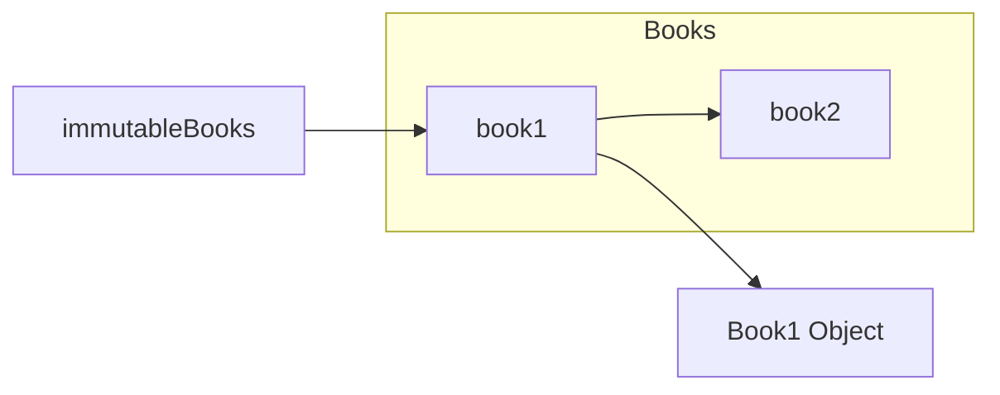

圣诞节前用Guava和内部框架写数据处理任务，因为不熟悉Java吃了不少苦头。假期宅家里偶然看[java8-tutorial](https://github.com/winterbe/java8-tutorial)，对Java的印象比~~试图~~用Java写Leetcode时好了许多，顺便看掉了Guava的文档。
Guava已有近十年历史，而且是以数据结构为主的工具库，读起来不那么惊艳，但还是有很多思路值得借鉴。

<!-- more -->

## Using/avoiding null

这篇很精彩，主要是举例说明null的歧义性和怎样避免用null。给的几个例子看得心虚：

- null作为Set/Map的key -> 显示处理查询null的情况
- null作为Map的value -> 用单独的Set记录value为null的key
- null作为处理情形 -> 定义枚举值

这些方法的确能压缩代码行数，但增加了使用者的思维负担，比如`Map.get(key)`返回null时可能是key不存在，也可能是key对应的value就是null。现在想增加readability的重点之一就是消除自认为显然的假定，short$\neq$simple。

`Optional<T>`是大势所趋。昨天和朋友聊RESTful的意义，r结论是很多封装是为了让编程时更不容易出错(hard to misuse)，深以为然。

## Ordering

文档中将`Ordering`形容为”fluent comparator“，将其和Java 8中的Comparator对比还是挺有意思的。
一个常见需求是多条件排序，假设有一个Book类的List要先按name排序，后按year排序：

```Java
class Book {
  public String name;
  public int year;
}
// Java 8 Comparator
books.sort(Comparator.comparing((Book x) -> x.name)
                .thenComparing((Book x) -> x.year));

// Guava Ordering
Ordering<Book> byName = new Ordering<Book>() {
  @Override
  public int compare(@Nullable Book book1, @Nullable Book book2) {
    return book1.name.compareTo(book2.name);
  }
};
Ordering<Book> byYear = new Ordering<Book>() {
  @Override
  public int compare(@Nullable Book book1, @Nullable Book book2) {
    return book1.year - book2.year;
  }
};

books.sort(byName.compound(byYear));
```

它们都提供了chaining，做法各有优劣。每个排序条件很简单时comparing/thenComparing很爽，但假设Book的name可能有书名号《》，比较的时候要先去掉，那comparing/thenComparing就没这么干净了；`Ordering`这时可读性更好，而且每个`Ordering`可以作为组件用于以后组装新`Ordering`。

## Immutable Collection

个人看法这里immurtable的用词有点误导，当描述一个集合不可变时，直觉是里面的所有元素也不可变，但Guava的Immutable Collection中元素本身是可以修改的：

```java
Book book1 = new Book("book 1", 2018);
Book book2 = new Book("book 2", 2018);
Book book3 = new Book("book 3", 2018);

ImmutableList<Book> immutableBooks = ImmutableList.of(book1, book2);
book1.name = "renamed book 1";
immutableBooks.get(1).name = "renamed book 2";
immutableBooks.add(book3);	// UnsupportedOperationException
```

套用[ImmutableList and unmodifiableList](https://stackoverflow.com/questions/2185789/what-is-the-difference-between-googles-immutablelist-and-collections-unmodifiab)的解释：
> The immutability is only applied to the amount and references of the objects in the Collection, and does not address the mutability of objects you put in the Collection.



用C++解释的话图中book1和book2都是const指针，无法让book1指向别的Book对象，但却可以通过book1修改其指向的对象；Guava的Immutable Collection相当于保存了固定数量、固定值的const指针。
这么解释`ImmutableList`还是合理的，而`UnmodifiableList`套了一层wrapper就称为不可变实在太甜。

实现元素不可变的方法很多，做法之一是用[auto](https://github.com/google/auto)中的`@AutoValue`:

```Java
@AutoValue
abstract class Book {
    public abstract String name();
    public abstract int year();
    public static Book create(String name, int year) {
        return new AutoValue_Book(name, year);
    }
}
```
文档里提到Immutable Collection的优点，一个是thread safety(不完全正确，元素可能可变)，一个是更加 memory efficient，比如Map不需要可变操作的话可以用有序数组代替树结构。

## Others

- `PeekingIterator`实现了`peek()`
- `Cache`类的几种eviction方法里基于size和time常见，reference-based eviction第一次见到
- `Range `完善了一般的`pair<int, int>`实现，避免开闭区间的假定问题
